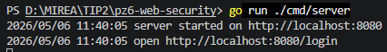
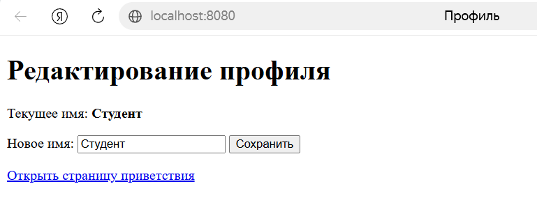
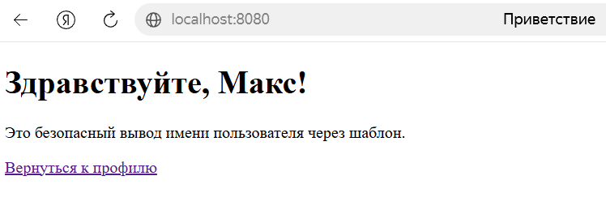
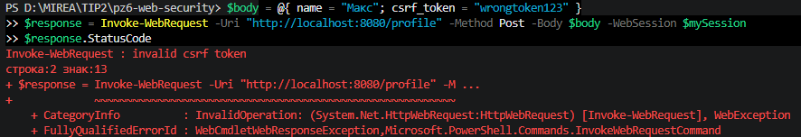
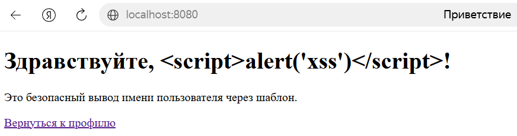
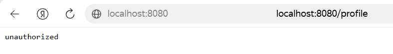

# Практическое занятие №6
# Реализация защиты от CSRF/XSS. Работа с secure cookies

**Дисциплина:** Технологии индустриального программирования  
**Семестр:** 2, 2025-2026  
**Студент:** Синицын А.Г. ЭФМО-01-25

---

## Краткое описание проекта

Реализовано учебное web-приложение с демонстрацией защиты от CSRF и XSS, а также безопасной работой с cookies.

Поддерживаются маршруты:
- `GET /login` – имитация входа, установка сессионной cookie с флагами **HttpOnly** и **SameSite**.
- `GET /profile` – страница редактирования имени пользователя. В форму встроен CSRF-токен.
- `POST /profile` – обновление имени с обязательной проверкой CSRF-токена.
- `GET /hello` – приветственная страница, где имя выводится через HTML-шаблон (защита от XSS).
- `GET /logout` – (доп. задание) завершение сессии, удаление cookie и профиля из хранилища.

Приложение использует:
- Генерацию криптостойких случайных токенов для сессии и CSRF.
- Настройку cookie с HttpOnly (защита от доступа JavaScript), SameSite=Lax (частичная защита от CSRF). В учебном окружении Secure выключен, так как используется HTTP.
- Проверку CSRF-токена при каждом изменении данных.
- Шаблонизацию Go (html/template) для безопасного вывода пользовательского ввода.

---

## Структура проекта
```
pz6-web-security/
├── cmd/
│   └── server/
│       └── main.go
├── internal/
│   ├── auth/
│   │   ├── cookie.go
│   │   └── csrf.go
│   ├── httpapi/
│   │   └── handler.go
│   └── store/
│       └── store.go
├── templates/
│   ├── profile.html
│   └── hello.html
├── go.mod
└── README.md
```

---

## Требования к проекту

- Go 1.21+
- Стандартная библиотека (дополнительных зависимостей нет)
- Свободный порт 8080

---

## Результаты выполнения (скриншоты)

### Успешный запуск сервера


### Переход на /login и установка cookie


### Успешное изменение имени и приветствие


### Ошибка при неверном CSRF-токене (403)


### Безопасное отображение скрипта (вместо выполнения)


### Logout – очистка cookie и возврат на /login


---

## Ответы на контрольные вопросы

**1. Что такое CSRF?**  
CSRF (Cross-Site Request Forgery) – атака, при которой браузер автоматически отправляет запрос на сайт от имени авторизованного пользователя, используя сохранённые cookies. Пользователь не осознаёт, что инициирует действие, а сервер доверяет запросу, так как в нём присутствует валидная сессионная cookie.

**2. Почему наличие cookie не гарантирует, что запрос действительно инициировал пользователь?**  
Потому что браузер автоматически прикрепляет cookie к любому запросу на соответствующий домен. Если злоумышленник заставит браузер жертвы выполнить запрос (например, через скрытую форму или ссылку), сервер получит тот же набор cookie, что и при легитимном действии.

**3. Что такое XSS?**  
XSS (Cross-Site Scripting) – внедрение вредоносного клиентского кода (обычно JavaScript) в страницу, которую просматривает другой пользователь. Возникает, когда приложение выводит пользовательские данные в HTML без достаточного экранирования, позволяя браузеру интерпретировать их как активный код.

**4. Чем CSRF отличается от XSS?**  
CSRF эксплуатирует доверие сервера к браузеру: сервер считает запрос легитимным, видя знакомую cookie. XSS эксплуатирует доверие браузера к данным, полученным от сервера: браузер исполняет вредоносный фрагмент как часть страницы. CSRF атакует механику авторизованных запросов, XSS – отображение данных.

**5. Для чего нужен CSRF-токен?**  
CSRF-токен – уникальное случайное значение, которое сервер генерирует для сессии и встраивает в форму. При отправке формы сервер сравнивает токен из запроса с сохранённым. Поскольку злоумышленник не может прочитать токен из чужой сессии, он не сможет сформировать валидный POST-запрос.

**6. Что делает атрибут HttpOnly у cookie?**  
Запрещает доступ к cookie из JavaScript (через document.cookie). Это снижает риск кражи идентификатора сессии через XSS-уязвимости.

**7. Для чего нужен атрибут Secure?**  
Указывает браузеру отправлять cookie только по защищённому соединению (HTTPS). В локальной учебной среде, где HTTPS не настроен, атрибут оставлен false, но в реальном проекте должен быть true.

**8. Какую роль играет SameSite?**  
Определяет, будет ли cookie отправляться вместе с запросами, инициированными сторонними сайтами. Режим **Lax** разрешает отправку cookie только при навигации пользователя (например, по ссылке), но не при загрузке изображений или отправке форм со стороннего домена. Это частично защищает от CSRF.

**9. Почему нельзя вставлять пользовательский ввод в HTML через конкатенацию строк?**  
Потому что при конкатенации строк невозможно гарантировать, что введённый текст не содержит HTML-теги или JavaScript. Браузер интерпретирует полученную разметку «как есть», и вредоносный код будет выполнен. Это прямой путь к XSS-уязвимости.

**10. Почему шаблоны безопаснее ручной сборки HTML?**  
Шаблонизатор html/template автоматически экранирует выводимые данные в соответствии с контекстом (HTML, атрибуты, JavaScript). Пользовательский ввод преобразуется в безопасный текст: символы <, >, & и т.д. заменяются на HTML-сущности, и браузер отображает их как текст, а не как разметку.
